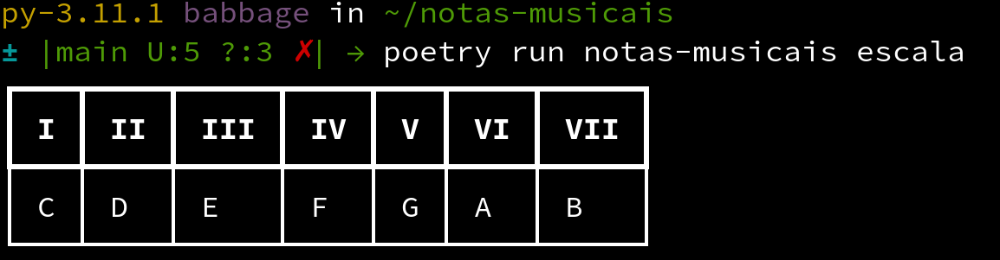
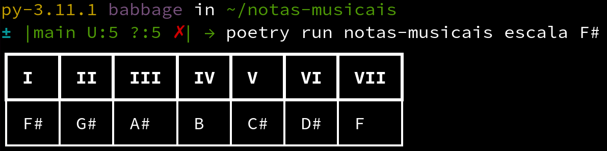
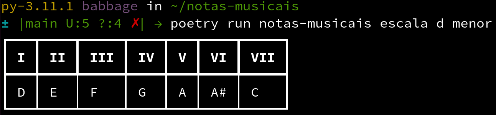
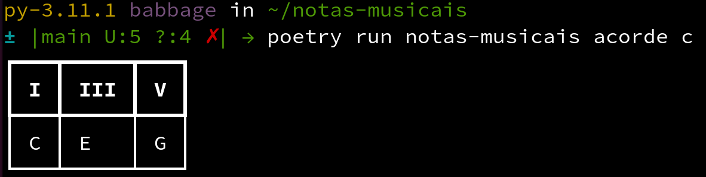
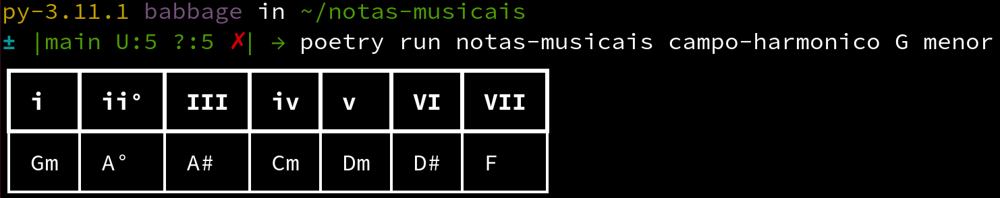

# Tutorial

Se você chegou até aqui, significa que quer aprender mais sobre o `notas-musicais`.

O objetivo desse projeto é ajudar estudantes de música ou profissionais a obter fácil acesso a escalas, formação de acordes e campos harmônicos. Onde cada um desses comandos é distribuído em um subcomando do nosso cli.




## Os comandos

O `notas-musicais` distribui cada função em um subcomando e você executar cada um deles para testar agora. O objetivo desse tutorial é explicar o básico do funcionamento da aplicação em linha de comando.

Os subcomandos são divididos em três funções até o momento: `escalas`, `acordes` e `campo-harmonico`. 

Vamos entender o que cada um se propõe a fazer agora.

### Escalas

O subcomando de escalas nos auxilia a ter fácil acesso à formação das escalas musicais.

Caso seja invocado sem nenhum parâmetro, retornará a escala de Dó maior:

```bash
{{ commands.run }} escalas
```

Com isso será fornecida uma tabela no terminal informando a escala:

| I | II | III | IV | V | VI | VII |
| - | -- | --- | -- | - | -- | --- |
| C | D  | E   | F  | G | A  | B   |


Um exemplo da tabela no terminal:




#### Variações nas escalas

Para alterar as escalas, você pode alterar os parâmetros: `tonica` e `tonalidade`. Eles são chamados na seguinte ordem:

```bash
{{ commands.run }} escala [TONICA] [TONALIDADE]
```

##### Variação da tônica

A variação da tônica pode ser feita em qualquer nota. Por exemplo, se quisermos alteração da escala de Fá sustenido:

```bash
{{ commands.run }} escala F#
```

Isso nos fornecerá, o seguinte resultado:

| I | II | III | IV | V | VI | VII |
| - | -- | --- | -- | - | -- | --- |
| F# | G#  | A#   | B  | C# | D#  | F   |

No terminal:




##### Variação da tonalidade

Você pode alterar a tonalidade usando o segundo parâmetro. Por exemplo, a escala menor de Ré:

```bash
{{ commands.run }} escala d menor
```

Obtendo a seguinte tabela:

| I | II | III | IV | V | VI | VII |
| - | -- | --- | -- | - | -- | --- |
| D | E  | F   | G  | A | A# | C   |


Um exemplo da visualização no terminal:




### Acordes

O subcomando de acordes se baseia em mostrar em quais graus estão relacionados dentro da escala maior. De forma em que você passa uma cifra e ele diga quais são as notas contidas nesse acorde e os graus correspondentes.

Por exemplo, um acorde de Ré menor aumentado `Dm+`:

```bash
{{ commands.run }} acorde Dm+
```
isso nos mostrará os graus e as notas referentes a esse acorde em relação à escala maior de ré:

| I | III- | V+ |
| - | ---- | -- |
| D | F    | A# |

Pontos a se observar em relação a essa resposta:

- O sinal de `-` simboliza um semitom a menos. Ou seja, para ser o acorde maior, necessitaria que `F` fosse um `F#`.
- O sinal de `+` simboliza um semitom a mais. Ou seja, para ser o acorde maior, necessitaria que `A#` fosse um `A`.

!!! warning "Sobre os acordes"
	Pode ser que os acordes que você busque ainda não tenham sido implementados. No momento em que escrevo esse tutorial, somente acordes de tríade foram implementados. Dessa forma você pode usar acordes maiores, menores, aumentados e diminuto.

#### Outro exemplo para fixação

Se quisermos ver um acorde maior de Dó, poderíamos passar sua cifra e ver o resultado:

```bash
{{ commands.run }} acorde c
```

Obtendo o seguinte resultado

| I | III | V |
| - | --- | - |
| C | E   | G |


Note que nesse caso não temos nenhuma variação entre graus. Pois, o acorde já é maior!

Um exemplo da visualização da tabela no terminal:




### Campos harmônicos


Os campos harmônicos são as representações da escala com o uso de acordes. E seu subcomando tem o uso idêntico ao da `escala`. Variando, porém, sua chamada para `campo-haronico`:

```bash
{{ commands.run }} campo-harmonico [TONICA] [TONALIDADE]
```

#### Uso básico

Caso o comando seja chamado sem nenhuma tônica, retornará o campo harmônico de Dó maior:

```bash
{{ commands.run }} campo-harmonico
```

Obtendo, assim, uma tabela com todos os acordes correspondentes a esse campo:

| I | ii | iii | VI | V | vi | vii° |
| - | -- | --- | -- | - | -- | ---- |
| C | Dm | Em  | F  | G | Am | B°   |


#### Variação de tônica

Você pode enviar a tônica do campo harmônico como o primeiro parâmetro. Como o campo harmônico maior de La:


```bash
{{ commands.run }} campo-harmonico A
```

| I | ii | iii | VI | V | vi | vii° |
| - | -- | --- | -- | - | -- | ---- |
| A | Bm | C#m | D  | E | F#m | G#° |


#### Variação de tonalidade

O segundo parâmetro do comando de `campo-harmonico` é a tonalidade. Vamos pedir um campo harmônico menor de Sol:


```bash
{{ commands.run }} campo-harmonico G menor
```

Obteremos a varição da tonalidade

| i | ii° | III | iv | v | VI | VII |
| - | --- | --- | -- | - | -- | --- |
| Gm | A° | A# | Cm | Dm | D# | F |

Um exemplo de como isso se apresenta no terminal:



## Para saber mais

Caso queira descobrir mais utilidades para os comandos, você pode usar a flag `--help` em todos os subcomandos.

Dessa forma descobrir novas formas de usar o `notas-musicais`:

```bash
notas-musicais [comando] --help
```

## Sobre esse tutorial

Esse tutorial foi escrito em `2023-02-06`, os comandos podem receber novas atualizações. Então consultar o `--help` é uma boa maneira de se manter atualizado.

Caso tenha encontrado algum erro no tutorial ou deseje melhorar seu texto. Fique a vontade para contribuir com o projeto no link a seguir.

[Como contribuir com o projeto?](/02_contribua/)
