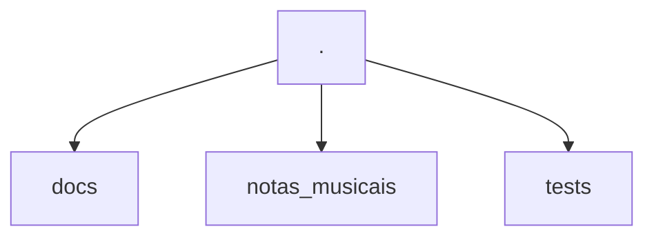
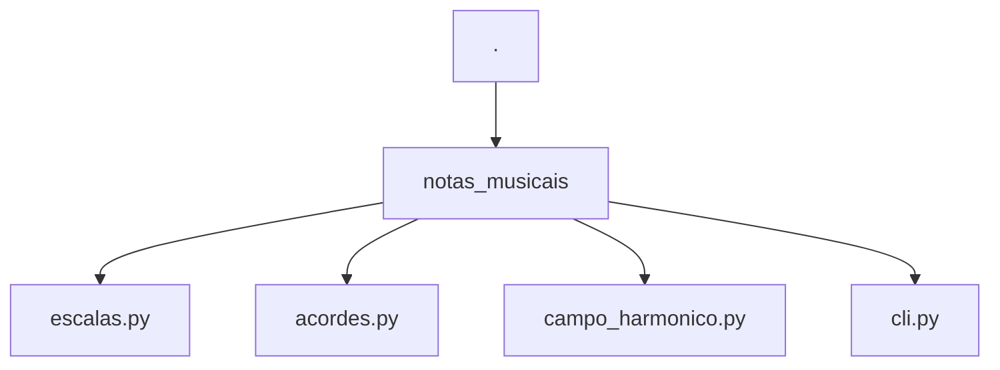
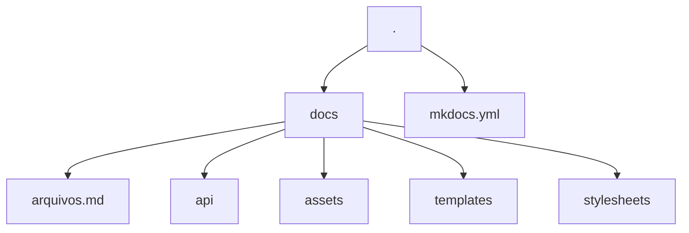

# Como contribuir

Obrigado por se interessar por contribuir no projeto `notas-musicais` :heart:. Nesse documento estão listadas as operações mais comuns e que você pode precisar para contribuir.

## Como o projeto funciona?

### Estrutura do projeto



O projeto é dividido em três diretórios. `docs`, `notas_musicais` e `tests`. Onde cada diretório tem sua função especifica.

#### notas_musicais



O código do CLI e da biblioteca estão em `notas_musicais`. A documentação da API do código também está sendo feita em `notas_musicais`. Com uso da ferramenta [mkdocstrings](https://mkdocstrings.github.io/) e seguem o padrão de [docstrings do google](https://sphinxcontrib-napoleon.readthedocs.io/en/latest/example_google.html). Então, caso altere alguma coisa no código, lembre-se de atualizar também as docstrings.

Os exemplos usados na docstring também estão sendo usados para testes. Então, caso altere o formato de saída, lembre-se de atualizar as docsintrgs.

#### Sobre a biblioteca

Toda a biblioteca usa python puro, ela não tem nenhuma dependência de bibliotecas externas. Isso é proposital, pois o código é bastante simples. As respostas das funções foram padronizadas com o retorno sempre sendo um dicionário python, pois em algum momento alguém pode querer expandir isso para uma interface gráfica ou usar em um API REST, dessa forma, acredito que um padrão que pode ser serealizado, pode ajudar bastante as pessoas.

Todas as vezes em que o código é consumido entre funções, durante a construção da aplicação foi criado um padrão para desempacotar o dicionário em outras funções. Então, não se preocupe se ver muito esse formato de código:

```py
notas, graus = funcao('arg1', 'arg2').values()
```

#### O CLI

O cli foi construído usando a biblioteca [Typer](https://typer.tiangolo.com/) e você pode checar a documentação dela para obter mais detalhes, caso queira expandir as funcionalidades do CLI.

Para as respostas ricas no output da aplicação, foi usada a biblioteca [Rich](https://rich.readthedocs.io/en/stable/introduction.html). Caso queira alterar algo em relação as tabelas geradas no output, pode ir direto na [pagina da documentação](https://rich.readthedocs.io/en/stable/tables.html) referente as tabelas.

A única convenção que está sendo seguida a respeito do CLI é que já foi definido um objeto `Console` do rich e um app do `Typer` seria interessante que você continue usando esses objetos

```py title="notas_musicais/cli.py"
from rich.console import Console
from typer import Argument, Typer

...

console = Console()
app = Typer()
```

#### tests

Para os testes estamos usando o [pytest](https://docs.pytest.org/). As configurações dele podem ser encontradas no arquivo [pyproject.toml](https://github.com/dunossauro/notas-musicais/blob/main/pyproject.toml) na raiz do nosso projeto.

Coisas importantes que você deve saber sobre os testes é que nem todos os testes estão somente no diretório `notas_musicais/tests`. A flag de `addopts = "--doctest-modules"` está sendo usada. Então, caso modifique algo, esteja ciente que as docstrings também rodam testes e são a base para documentação da API, então tome cuidado com alterações.

A cobertura dos testes está sendo gerada automaticamente com [pytest-cov](https://github.com/pytest-dev/pytest-cov) e são exibidas quando a task de testes é executada:

```bash
task tests
```

Assim como os linters são requisitos para esses testes.

#### Documentação

A documentação toda é baseada no uso de [mkdocs](https://www.mkdocs.org/) com o tema [mkdocs-material](https://squidfunk.github.io/mkdocs-material/).



Toda a configuração pode ser encontrada no arquivo [mkdocs.yml](https://github.com/dunossauro/notas-musicais/blob/main/mkdocs.yml) na raiz do repositório.

Também estão sendo usados diversos artifícios para complementar a documentação. Como templates do [jinja](https://jinja.palletsprojects.com/en/3.1.x/) nos lugares onde instruções podem se repetir. Caso encontre blocos como:

```html
{ %  % }
```

Saberá que se trata de um template.

Os templates estão definidos no diretório `/docs/templates`. Em alguns casos, porém, podem estar sendo chamados por variáveis com `command.run` que aparece em quase todos os arquivos de documentação. Essas macros estão sendo feitas com [mkdocs-macros](https://mkdocs-macros-plugin.readthedocs.io/en/latest/) e estão definidas no arquivo de configuração do mkdocs:

```yaml
extra:
  commands:
    run: poetry run notas-musicais
```

##### Documentação da API

A documentação da API está sendo feita dentro dos módulos do código. Por isso os arquivos que estão no diretório `docs/api` tem uma tag:

```md
::: modulo
```

Isso quer dizer que será usado o código contido nas docstrings nesse bloco. O plugin [mkdocstrings](https://mkdocstrings.github.io/) está sendo usado para tomar conta disso.

As documentações nos módulos seguem o formato de [docstrings do google](https://sphinxcontrib-napoleon.readthedocs.io/en/latest/example_google.html), que é o padrão da biblioteca


## Ferramentas

Esse projeto basicamente usa duas ferramentas como base para todo com controle:

- [Poetry](https://python-poetry.org/): Para o gerenciamento do ambiente e instalação de bibliotecas
- [Taskipy](https://github.com/illBeRoy/taskipy): Para automação de tarefas rotineiras. Como executar os testes, linters, documentação e etc...

Então, garanta que tem o poetry instalado para essa contribuição:

```bash
pipx install poetry
```


## Passos para executar tarefas específicas

Aqui estão listados comandos que você pode usar para executar tarefas corriqueiras. Como clonar o repositório, como instalar as dependências, executar os testes e etc...

### Como clonar o repositório

```bash
git clone https://github.com/dunossauro/notas-musicais.git
```

### Como instalar as dependências

```bash
poetry install
```

### Como executar o CLI

```bash
poetry run notas-musicais [subcomando]
```

### Como executar a verificação de código

```bash
task lint
```

### Como executar os testes

```bash
task test
```

### Como executar a documentação

```bash
task docs
```

### Tarefas em que você pode contribuir




## Não achei o que preciso aqui

Caso não tenha encontrado o que precisa, você pode abrir uma [issue no projeto](https://github.com/dunossauro/notas-musicais/issues) relatando o que não consegue fazer ou o que precisa ser melhor documentado

## Melhoria contínua

Esse documento pode ser melhorado por qualquer pessoa que tenha interesse em melhora-lo. Então, sinta-se a vontade para fornecer mais dicas as pessoas que desejam contribuir também :heart:
